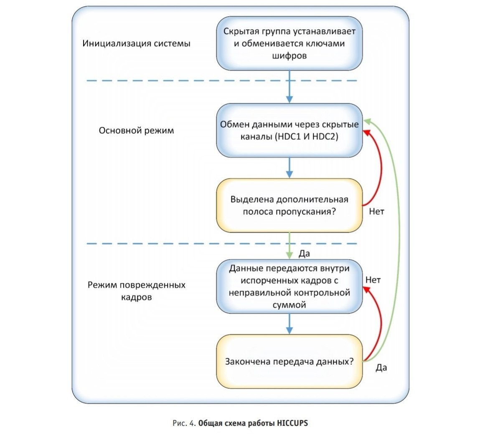
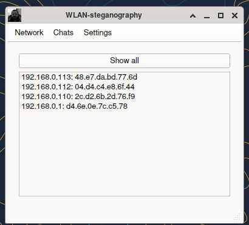
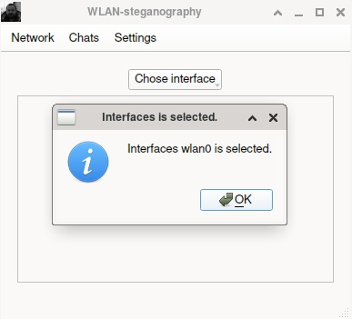
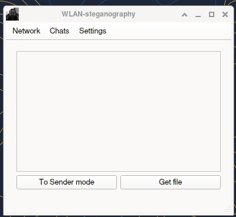
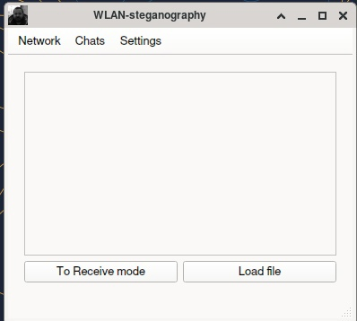
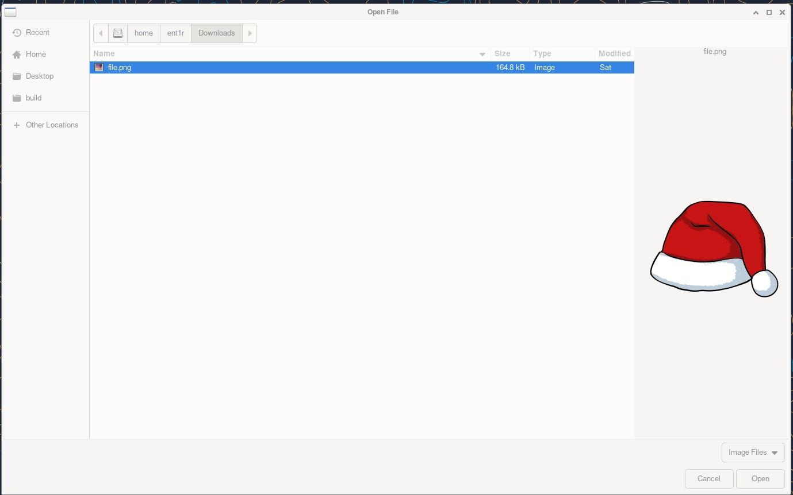
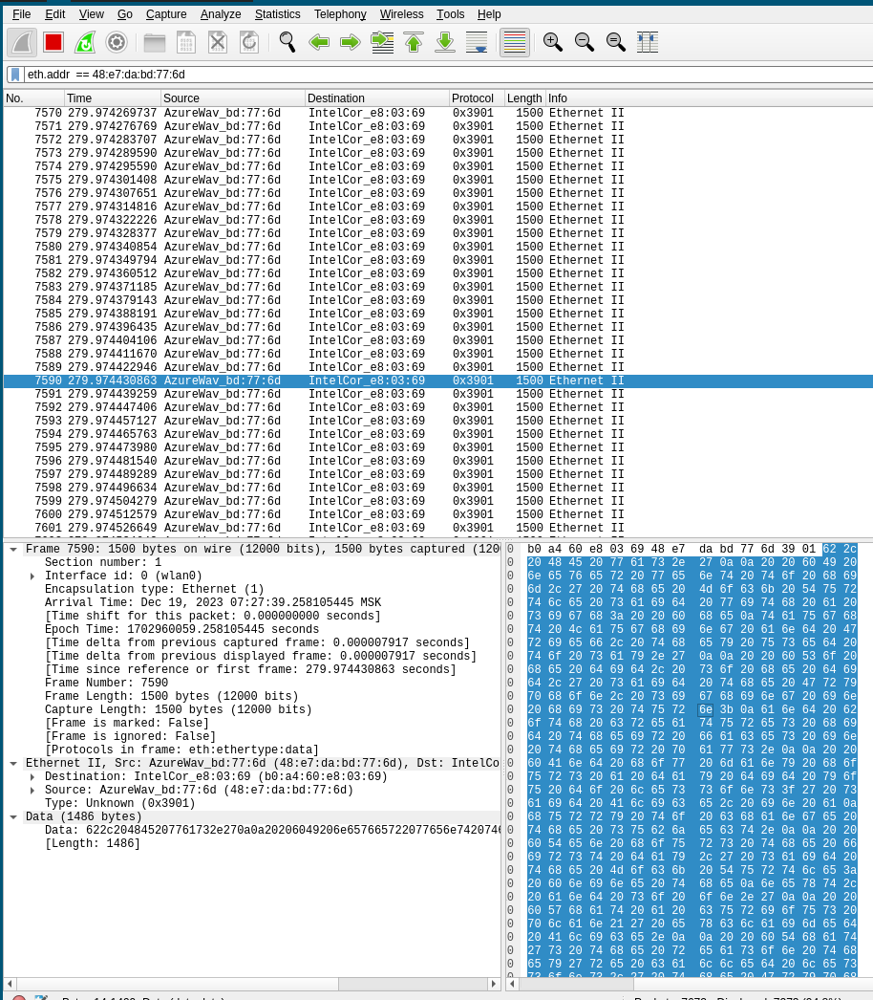

# WLAN-steganography

### Описание проекта
#### Классификация методов сетевой стеганографии
Методы сетевой стеганографии можно разделить на три группы:

1. Методы модификации пакетов:

    — методы, изменяющие данные в полях заголовков сетевых протоколов.

    — методы, изменяющие данные в полях полезной нагрузки пакетов — это всевозможные алгоритмы водяных знаков, речевых кодеков и прочих стеганографических техник по сокрытию данных;

    — методы, объединяющие два предыдущих класса;

2. Методы стеганографии, изменяющие структуру и
параметры передачи пакетов:

    — методы, в которых изменяется порядок следования пакетов;

    — методы, изменяющие задержку между пакетами;

    — методы, вводящие преднамеренные потери пакетов путём пропуска порядковых номеров у отправителя;


#### Система HICCUPS
Система HICCUPS (HIdden Communication system for CorrUPted NetworkS) — стеганографическая система с распределением полосы пропускания для сетей с разделяемой средой передачи данных (shared medium). HICCUPS использует несовершенства среды передачи — шумы и помехи, которые являются естественными причинами искажения данных.

«Прослушивание» всех передаваемых в среде кадров с данными и возможность отправки поврежденных кадров с неправильными значениями кодов коррекции — важнейшие сетевые функции для HICCUPS. В частности, беспроводные сети используют радиопередачу с переменной частотой битовых ошибок (BER), что создает возможность для инъекций «искусственных» поврежденных
кадров. В целом, новизна HICCUPS заключается в:

1. использовании защищенной телекоммуникационной сети, оборудованной криптографическими механизмами, для создания стеганографической системы;

2. новом протоколе с распределением пропускной способности для стеганографических целей, основанного на поврежденных кадрах.

Предлагаемая система предназначена для реализации в средах, обладающих следующими свойствами (обязательным является только свойство 1):

1. Разделяемая среда передачи данных с возможностью перехвата кадров;

2. Общеизвестный метод инициализации алгоритма шифрования, например, векторами инициализации;

3. Механизмы целостности для зашифрованных кадров, например, односторонняя хеш-функция, циклический избыточный код — CRC. В сети с описанными свойствами можно создать три скрытых канала данных в кадре MAC:

— HDC1: канал, основанный на векторах инициализации шифра;

— HDC2: канал, основанный на MAC-адресах (например, назначение и источник);

— HDC3: канал на основе значений механизма целостности (например, контрольной суммы кадра).

В сетях, где безопасность не обеспечивается, используются только HDC2 и HDC3. Большинство проводных сетей не поддерживают безопасность на уровне MAC, в отличие от беспроводных.

Общая схема работы HICCUPS


### Полученный результат
В результате реализации проекта были написаны библиотеки, предлагающие своё API для возможности использования HICCUPS в других проектах(но к сожалению пока только для Linux-систем). Так же было реализовано графическое приложение WLAN-Client для демонстрации. В режимах HDC3 сообщение передается в зашифрованном виде, за счет чего стегоанализ посылаемых сообщений становится проблематичным.

Общий вид приложения









### Анализ результатов:
В режимах HDC3 сообщение передается в зашифрованном виде, за счет чего стегоанализ посылаемых сообщений становится проблематичным.



### Как собрать проект? (now only for Linux systems)
```
mkdir build && cd build
cmake .. & cmake --build . -j$(nproc)
```
### Как запускать?
#### Графическое приложение (from build directory)
```
sudo ./Graphics/WLAN_Client
doas ./Graphics/WLAN_Client
```